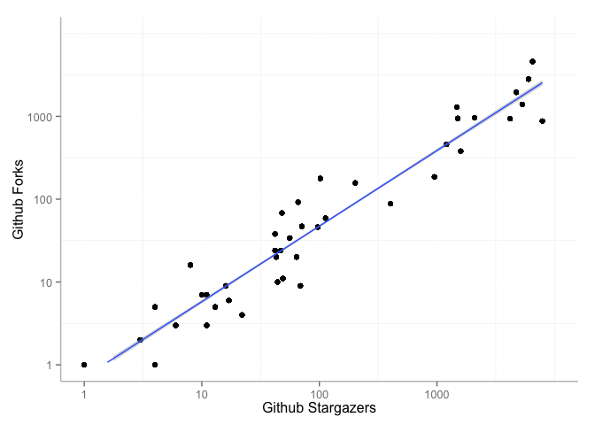
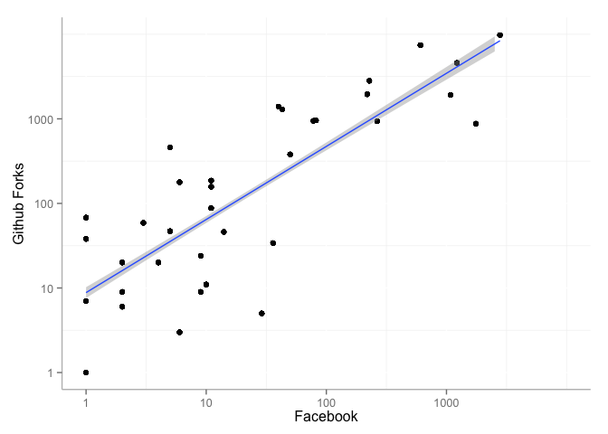

# Scatterplots

Collect metrics for a list of Github repos for scientific software stored in a CSV file.


```r
require("alm")
```

```
## Loading required package: alm
## 
## 
##  New to alm? Tutorial at http://ropensci.org/tutorials/alm_tutorial.html. Use suppressPackageStartupMessages() to suppress these startup messages in the future
```

```r
require("plyr")
```

```
## Loading required package: plyr
```

```r
require("ggplot2")
```

```
## Loading required package: ggplot2
```

```r
packages <- read.csv("github_repos.csv", encoding = "UTF8", sep = ",", stringsAsFactors=FALSE)
alm <- alm_ids(url = packages$url, api_url = "http://software.lagotto.io/api/v5/articles", total_details = TRUE)
alm <- ldply(alm$data)
# transform 0 values for log scaling
alm$github_likes[alm$github_likes == 0] <- 0.01
alm$github_readers[alm$github_readers == 0] <- 0.01
alm$facebook_total[alm$facebook_total == 0] <- 0.01
```

Scatterplot of Github stargazers vs. forks.


```r
ggplot(alm, aes(x=github_likes, y=github_readers)) +
  geom_point() + 
  geom_smooth(method=lm) +
  scale_x_log10(name = "Github Stargazers", limits = c(1,10000), breaks=c(1, 10, 100, 1000)) + 
  scale_y_log10(name = "Github Forks", limits = c(1,10000), breaks=c(1, 10, 100, 1000)) + 
  theme(panel.background = element_rect(fill = "white"),
        axis.line = element_line(colour = "grey")) 
```

```
## Warning: Removed 224 rows containing missing values (stat_smooth).
```

```
## Warning: Removed 224 rows containing missing values (geom_point).
```

```
## Warning: Removed 4 rows containing missing values (geom_path).
```

 

Scatterplot of Facebook vs. Github forks.


```r
ggplot(alm, aes(x=facebook_total, y=github_readers)) +
  geom_point() + 
  geom_smooth(method=lm) +
  scale_x_log10(name = "Facebook", limits = c(1,10000), breaks=c(1, 10, 100, 1000)) + 
  scale_y_log10(name = "Github Forks", limits = c(1,10000), breaks=c(1, 10, 100, 1000)) + 
  theme(panel.background = element_rect(fill = "white"),
        axis.line = element_line(colour = "grey")) 
```

```
## Warning: Removed 420 rows containing missing values (stat_smooth).
```

```
## Warning: Removed 420 rows containing missing values (geom_point).
```

 
